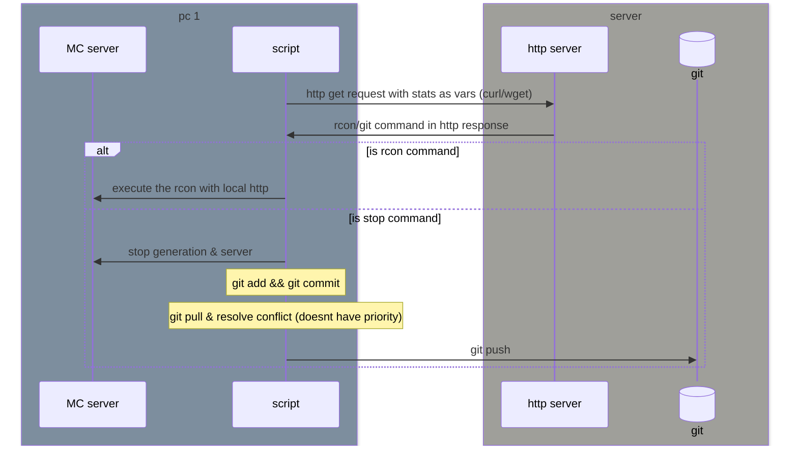

# MCMultiChunk
Allow multiple clients to act as server to pre load chunks simultaneously using Chunky and send it back to a Git server using *rclone*, *docker*

## how it works

```mermaid
sequenceDiagram
box rgba(33,66,99,0.5) pc 1
participant MC server
participant script
end
box rgba(100,100,90,0.5) server
participant http server
participant git@{ "type" : "database" }
end
    script->> http server: http get request with stats as vars (curl/wget)
    http server ->> script: rcon/git command in http response
    alt is rcon command
    script ->> MC server: execute the rcon with local http
    else is stop command
    script ->> MC server: stop generation & server
    note over script: git add && git commit
    note over script: git pull & resolve conflict (doesnt have priority)
    script ->> git: git push
    end
```
